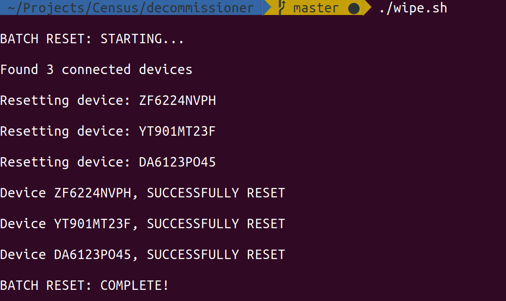

# Bash script to reset (via adb) Android (Pie) devices

This bash script can be used to reset Android devices that are connected via USB. It can reset as many devices as can be connected simultaneously.

It works by triggering the built in "Factory Reset" feature found in the Settings menu. The script executes each step by using simulated 'taps', 'typing' and other actions over the Android Debug Bridge (adb).

While it was written for a specific version of Android, the code is organized in such a way that each step/action is modular and well commented so that these same functions could be reorganized and modified to make it suitable for another version of Android.

# Requirements

## Hardware
* Device running Android 9, connected to your computer via USB
* Computer running Ubuntu and having at least one USB port
* USB hub (to plug in multiple devices at a time)


## Software
* The computer should be running a flavor of linux operating system that can execute bash scripts. It is theoretically possible to use it on windows via applications like [Git Bash](https://git-scm.com/downloads). The computer should have the following applications installed and functioning:
    * sqlite3
    * adb


## Environment
* USB debugging needs to be enabled on the devices to be reset. ([How To](https://developer.android.com/studio/debug/dev-options))

# Getting Started
## Setting Up
* Install all required applications on the computer
```
sudo apt install -y sqlite3 android-tools-adb
```

* Clone the repository using git:
```
git clone http://github.com/amestsantim/decommissioner
cd decommissioner
```

# Usage
## Preparation
1. Connect your USB hub to your computer and then plug in each android device in to your USB hub.
2. Enable USB debugging on each android device

## Executing
Execute the following command while in the decommissioner directory.
```
./wipe.sh
```
The script will attempt to execute the 'Factory Reset' steps on each connected device simultaneously and will output the results on screen as in the following example.



## Viewing Reports
The script logs the outcome of the 'Factory Reset' attempt for each device in an SQLite3 database. The file is saved by the name 'ACTIVITY_LOG.sqlite3' in the decommissioner directory.

You can use any SQLite database browser such as [DB Browser for SQLite](https://sqlitebrowser.org/) to open the file and view the 'results' table.

The 'results' table has four columns 
1. **id** - auto-generated sequence of integers starting at 1
2. **device** - the device id of the android device
3. **timestamp** - the date and time at which the device was reset
4. **result** - the outcome of the attempt. Possible values here are 'Successfully reset' or 'Failed to reset'

# Note
This script was commissioned by UNECA for use by member states, in connection with CAPI censuses tablet decommissioning.